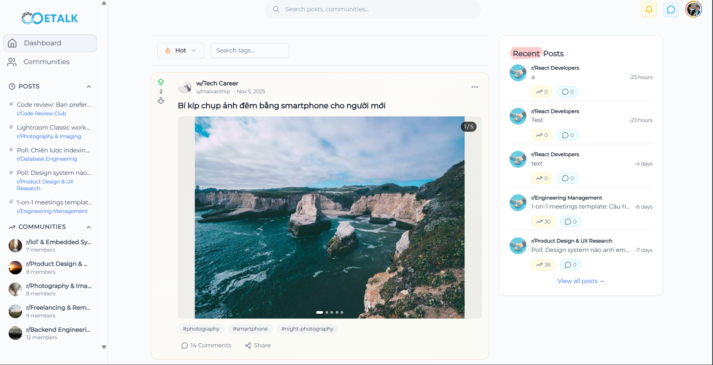
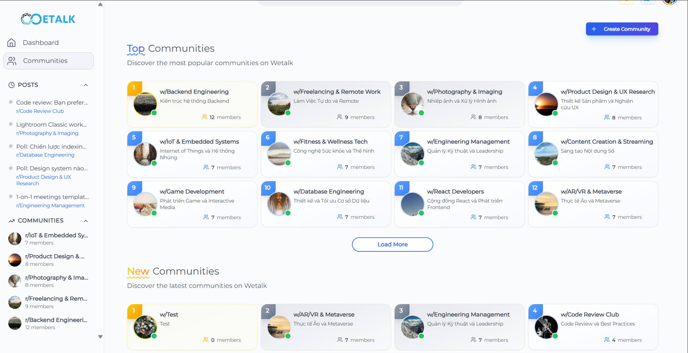

<div align="center">

  <div>
    
    
    
    
    
    
  </div>

  <h3 align="center">WeTalk</h3>

   <div align="center">
    <p>
        Labor of love — a Social Media for Developers.
    </p>
    </div>
</div>

## Introduction

Inspired by [Medium](https://medium.com/) and [Reddit](https://www.reddit.com/), WeTalk is a social media platform for developers.

## Features

Wetalk is a place where developers can connect, share their knowledge, and learn from other developers.

<details open>
<summary>Click to collapse image</summary>    
<pre>

</pre>
</details>

At first glance, it looks like a pretty standard social media platform, but if we scroll down a bit, we come across something really deep:

<details open>
<summary>Click to collapse gif</summary>    
<pre>

</pre>
</details>
<details open>
<summary>Click to collapse gif</summary>    
<pre>

</pre>
</details>

...And more features waiting for you to discover.

Some highlights include:

- **Community**: WeTalk is a place where developers can connect, share their knowledge, and learn from other developers.
- **Post**: Share your knowledge with the world though various post formats, from text, media to poll.
- **Comment**: Comment on posts and share your thoughts.
- **Voting**: Upvote posts and comments.
- **Create and manage communities**: Create and manage communities to connect with like-minded developers.
- **Realtime chat**: Realtime chat with other users.
- **Realtime notifications**: Realtime notifications.
- **AI Chatbox**: View summary of posts with wetake AI.
- **Personal Suggestions**: Personal suggestions based on your interests.
- **Automation censoring**: AI-powered automation censoring post and comment.

## Tech Stack

- React
- React Router
- React Query
- TypeScript
- Tailwind CSS
- Zustand

## Running Locally

WeTalk is live at [WeTalk](https://wetalk-ute.vercel.app/). For running locally, follow these steps to set up the project on your machine.

**Prerequisites**

This project was build with React, so make sure you have the following installed on your machine:

- [Git](https://git-scm.com/)
- [Node.js](https://nodejs.org/en)
- [npm, yarm or pnpm (recommended)](https://www.npmjs.com/)

> [!NOTE]
> While you can run this project using any package manager, I highly recommend using [`pnpm`](https://pnpm.io/) as your package manager, as it's faster and more efficient than `npm` or `yarn`.

**Cloning the Repository**

```bash
git clone https://github.com/NVHoaiDT/wetalk
cd wetalk
```

**Installation**

Install the project dependencies using pnpm:

```bash
pnpm install
```

**Running the Project**

```bash
pnpm dev
```

Open [http://localhost:5173](http://localhost:5173) in your browser to view the project.
